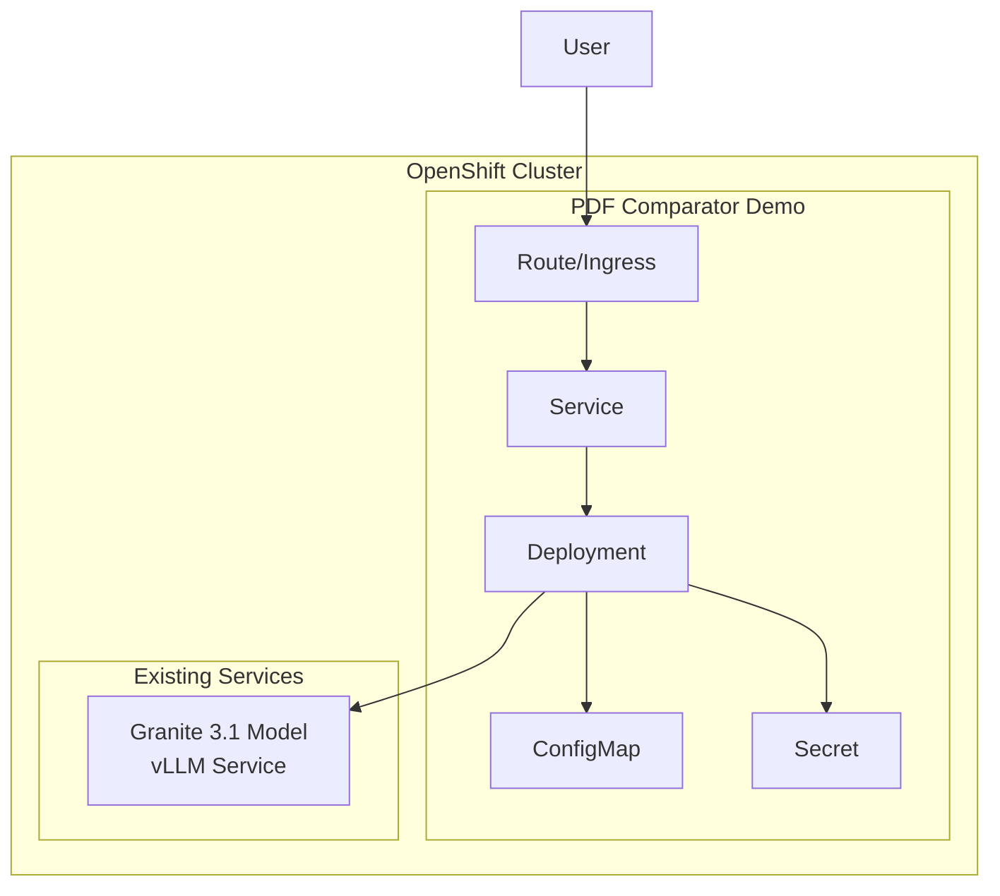

# 🤖 PDF Comparator AI - OpenShift Demo

<div align="center">

[](https://opensource.org/licenses/MIT)
[](https://www.openshift.com/)
[](https://www.python.org/)
[](https://github.com/vllm-project/vllm)
[](https://argoproj.github.io/cd/)
[](https://www.langchain.com/)

**An intelligent system for comparing PDF documents using AI with vLLM and LangChain**

[API Docs](https://pdf-comparator-demo.apps.your-cluster.com/api/docs) | [Issues](https://github.com/pkstaz/pdf-comparator-ai/issues) | [Author](mailto:cestay@redhat.com)

</div>

## 📋 Table of Contents

- [Overview](#-overview)
- [Features](#-features)
- [Architecture](#-architecture)
- [Prerequisites](#-prerequisites)
- [Quick Deployment](#-quick-deployment)
- [Configuration](#-configuration)
- [Usage](#-usage)
- [ArgoCD Customization](#-argocd-customization)
- [API Documentation](#-api-documentation)
- [Troubleshooting](#-troubleshooting)
- [License](#-license)

## 🌟 Overview

PDF Comparator AI is a production-ready demonstration application showcasing how to build an enterprise-grade document analysis system using modern AI technologies. This demo is designed to work with an existing Granite 3.1 model deployment on OpenShift.

### 🎯 Use Cases

- Legal document comparison and contract analysis
- Technical documentation change tracking
- Policy and procedure revision management
- Business proposal difference detection
- Regulatory compliance document auditing

## ✨ Features

### 🔍 Multiple Analysis Types
- **Basic Analysis**: Line-by-line comparison using difflib
- **Semantic Analysis**: Conceptual similarity using embeddings
- **TF-IDF Analysis**: Key term and topic identification
- **AI Analysis**: Contextual understanding using Granite 3.1
- **Structural Analysis**: Document organization changes

### 🤖 Advanced AI Capabilities
- **vLLM Integration**: Connects to existing Granite model deployment
- **LangChain Processing**: Complex AI workflow orchestration
- **Multi-language Support**: English, Spanish, Portuguese
- **Streaming Responses**: Real-time AI-generated insights

### ☁️ Cloud Native Architecture
- **OpenShift Ready**: Designed for OpenShift 4.x+
- **GitOps Enabled**: Full ArgoCD integration
- **Container Native**: Optimized container images
- **Dynamic Configuration**: All settings configurable via ArgoCD

## 🏗️ Architecture



## 📋 Prerequisites

- **OpenShift 4.x cluster** with cluster-admin or appropriate permissions
- **Granite 3.1 model** already deployed (vLLM service)
- **oc CLI** installed and configured
- **ArgoCD** (optional, will use standard deployment if not available)

## 🚀 Quick Deployment

### 1. Clone the Repository

```bash
git clone https://github.com/pkstaz/pdf-comparator-ai.git
cd pdf-comparator-ai
```

### 2. Deploy the Demo

#### Option A: Using Default Configuration
```bash
# Deploy with default Granite endpoint
./deploy-demo.sh deploy
```

#### Option B: With Custom Granite Endpoint
```bash
# Set your Granite model endpoint
export GRANITE_ENDPOINT="http://your-granite-service.your-namespace.svc.cluster.local:8000"
export GRANITE_MODEL_NAME="granite-3.1-8b-instruct"

# Deploy
./deploy-demo.sh deploy
```

### 3. Access the Application

After deployment completes, you'll see:
```
=================================================
   Deployment Completed Successfully! 🎉
=================================================

Access Information:
  Web UI: https://pdf-comparator-demo.apps.your-cluster.com
  API Docs: https://pdf-comparator-demo.apps.your-cluster.com/api/docs
  Health Check: https://pdf-comparator-demo.apps.your-cluster.com/health
```

## ⚙️ Configuration

### Environment Variables

| Variable | Description | Default |
|----------|-------------|---------|
| `GRANITE_ENDPOINT` | Granite model service URL | `http://granite-service.vllm.svc.cluster.local:8000` |
| `GRANITE_MODEL_NAME` | Model identifier | `granite-3.1-8b-instruct` |
| `VLLM_API_KEY` | API key for vLLM | `demo-api-key` |
| `DEMO_NAMESPACE` | Namespace for deployment | `pdf-comparator-demo` |

### Deployment Commands

```bash
# Deploy using pre-built image
./deploy-demo.sh deploy

# Build image locally and deploy
./deploy-demo.sh build-deploy

# View deployment information
./deploy-demo.sh info

# View application logs
./deploy-demo.sh logs

# Remove demo deployment
./deploy-demo.sh cleanup
```

## 🔧 Usage

### Web Interface

1. Access the web UI at the provided URL
2. Upload two PDF documents
3. Select analysis types
4. View comparison results

### API Usage

#### Health Check
```bash
curl https://pdf-comparator-demo.apps.your-cluster.com/health
```

#### Compare PDFs
```bash
curl -X POST https://pdf-comparator-demo.apps.your-cluster.com/api/v1/compare \
  -F "pdf1=@document1.pdf" \
  -F "pdf2=@document2.pdf" \
  -F 'request={"analysis_types":["semantic","ai"],"language":"en"}'
```

#### Interactive API Documentation
Visit: `https://pdf-comparator-demo.apps.your-cluster.com/api/docs`

## 🎛️ ArgoCD Customization

If ArgoCD is available, the deployment will automatically create an ArgoCD Application. You can then customize all parameters through the ArgoCD UI or CLI.

### Using ArgoCD CLI

```bash
# View current parameters
argocd app get pdf-comparator-demo --show-params

# Update Granite endpoint
argocd app set pdf-comparator-demo \
  -p vllm.endpoint=http://new-granite-service:8000

# Change replica count
argocd app set pdf-comparator-demo \
  -p app.replicaCount=2

# Update multiple parameters
argocd app set pdf-comparator-demo \
  -p config.logLevel=DEBUG \
  -p config.maxPdfSizeMb=100 \
  -p config.features.enableCaching=true

# Sync changes
argocd app sync pdf-comparator-demo
```

### Key Parameters

| Parameter | Description | Default |
|-----------|-------------|---------|
| `app.replicaCount` | Number of pods | 1 |
| `config.logLevel` | Logging level | INFO |
| `vllm.endpoint` | Granite service URL | (from env) |
| `vllm.model.temperature` | Model temperature | 0.3 |
| `config.maxPdfSizeMb` | Max PDF size | 50 |

See [ArgoCD documentation](docs/argocd-parameters.md) for complete parameter list.

## 📡 API Documentation

### Endpoints

| Method | Endpoint | Description |
|--------|----------|-------------|
| GET | `/health` | Health check |
| GET | `/ready` | Readiness check |
| GET | `/metrics` | Prometheus metrics |
| POST | `/api/v1/compare` | Compare two PDFs |
| POST | `/api/v1/chat` | Chat interface |
| GET | `/api/docs` | Swagger UI |
| GET | `/api/redoc` | ReDoc UI |

### Example Response

```json
{
  "request_id": "req_1234567890",
  "status": "success",
  "results": {
    "basic": {
      "similarity_ratio": 0.85,
      "added_lines": 45,
      "removed_lines": 23
    },
    "semantic": {
      "overall_similarity": 0.92
    },
    "ai": {
      "comparison": "The documents show significant updates in sections 2 and 3...",
      "key_differences": ["Updated pricing", "New terms"],
      "recommendations": ["Review pricing changes", "Update internal docs"]
    }
  },
  "execution_time": 2.34
}
```

## 🔍 Troubleshooting

### Common Issues

#### 1. Granite endpoint not reachable
```bash
# Check if Granite service exists
oc get svc -A | grep granite

# Test connectivity
oc run test-curl --image=curlimages/curl --rm -it -- \
  curl http://granite-service.vllm.svc.cluster.local:8000/health
```

#### 2. Deployment fails
```bash
# Check deployment status
oc get pods -n pdf-comparator-demo

# View pod logs
oc logs -n pdf-comparator-demo deployment/pdf-comparator

# Check events
oc get events -n pdf-comparator-demo --sort-by='.lastTimestamp'
```

#### 3. ArgoCD sync issues
```bash
# Force sync
argocd app sync pdf-comparator-demo --force

# Check sync status
argocd app get pdf-comparator-demo
```

### Getting Help

- Create an issue: [GitHub Issues](https://github.com/pkstaz/pdf-comparator-ai/issues)
- Contact: [cestay@redhat.com](mailto:cestay@redhat.com)

## 📄 License

This project is licensed under the MIT License - see the [LICENSE](LICENSE) file for details.

## 👤 Author

**Carlos Estay**
- Email: cestay@redhat.com
- GitHub: [@pkstaz](https://github.com/pkstaz)
- Company: Red Hat

---

<div align="center">

**This is a public demo. Feel free to use, modify, and share!**

Made with ❤️ for the OpenShift community

</div>