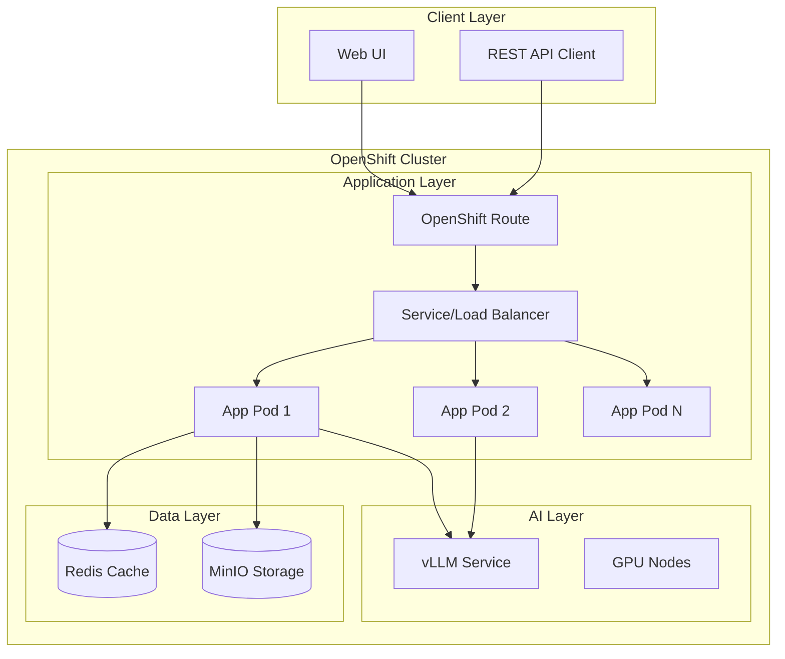

# 🤖 PDF Comparator AI - OpenShift Demo

<div align="center">

[](https://opensource.org/licenses/MIT)
[](https://www.openshift.com/)
[](https://www.python.org/)
[](https://github.com/vllm-project/vllm)
[](https://argoproj.github.io/cd/)
[](https://www.langchain.com/)

**An intelligent system for comparing PDF documents using AI with vLLM and LangChain**

[Live Demo](https://pdf-comparator.apps.your-cluster.com) | [Documentation](docs/) | [API Docs](https://pdf-comparator.apps.your-cluster.com/api/docs) | [Issues](https://github.com/pkstaz/pdf-comparator-ai/issues)

</div>

## 📋 Table of Contents

- [Overview](#-overview)
- [Features](#-features)
- [Architecture](#-architecture)
- [Quick Start](#-quick-start)
- [Configuration](#-configuration)
- [Usage](#-usage)
- [Development](#-development)
- [OpenShift Deployment](#-openshift-deployment)
- [ArgoCD Customization](#-argocd-customization)
- [API Documentation](#-api-documentation)
- [Contributing](#-contributing)
- [License](#-license)
- [Author](#-author)

## 🌟 Overview

PDF Comparator AI is a production-ready demonstration application showcasing how to build an enterprise-grade document analysis system using modern AI technologies:

- **vLLM** with IBM's **Granite 3.1-8b-Instruct** model for high-performance inference
- **LangChain** for AI orchestration and complex workflows
- **OpenShift** for enterprise Kubernetes deployment
- **ArgoCD** for GitOps and dynamic configuration management
- **FastAPI** for high-performance REST APIs

### 🎯 Use Cases

- Legal document comparison and contract analysis
- Technical documentation change tracking
- Policy and procedure revision management
- Business proposal difference detection
- Regulatory compliance document auditing
- Academic paper plagiarism detection

## ✨ Features

### 🔍 Multiple Analysis Types
- **Basic Analysis**: Line-by-line comparison using difflib
- **Semantic Analysis**: Conceptual similarity using embeddings
- **TF-IDF Analysis**: Key term and topic identification
- **AI Analysis**: Contextual understanding using Granite 3.1
- **Structural Analysis**: Document organization changes

### 🤖 Advanced AI Capabilities
- **vLLM Integration**: Optimized inference with GPU acceleration
- **Granite 3.1-8b-Instruct**: IBM's state-of-the-art language model
- **LangChain Processing**: Complex AI workflow orchestration
- **Multi-language Support**: English, Spanish, Portuguese
- **Streaming Responses**: Real-time AI-generated insights

### ☁️ Cloud Native Architecture
- **OpenShift Ready**: Designed for OpenShift 4.x+
- **GitOps Enabled**: Full ArgoCD integration
- **Microservices**: Modular, scalable architecture
- **Container Native**: Optimized container images
- **12-Factor App**: Following cloud-native best practices

### 🔧 Enterprise Features
- **High Availability**: Multi-replica deployments
- **Auto-scaling**: HPA with custom metrics
- **Observability**: Prometheus metrics & distributed tracing
- **Security**: RBAC, network policies, secret management
- **Multi-tenancy**: Environment isolation

## 🏗️ Architecture



## 🚀 Quick Start

### Prerequisites

- OpenShift 4.x cluster
- GPU nodes for vLLM (NVIDIA T4 or better)
- ArgoCD (OpenShift GitOps Operator)
- `oc` CLI tool
- `argocd` CLI tool

### 1. Clone and Setup Repository

```bash
# Clone the repository
git clone https://github.com/pkstaz/pdf-comparator-ai.git
cd pdf-comparator-ai

# Run the setup script
./setup-repo.sh

# Deploy to OpenShift
./deploy.sh
```

### 2. Access the Application

```bash
# Get the route
oc get route -n pdf-comparator-prod

# Access the application
https://pdf-comparator.apps.your-cluster.com
```

### 3. Try the API

```bash
# Health check
curl https://pdf-comparator.apps.your-cluster.com/health

# Compare PDFs
curl -X POST https://pdf-comparator.apps.your-cluster.com/api/v1/compare \
  -F "pdf1=@document1.pdf" \
  -F "pdf2=@document2.pdf" \
  -F "request={\"analysis_types\":[\"semantic\",\"ai\"]}"
```

## ⚙️ Configuration

### Environment-Specific Values

The application supports three environments with different configurations:

| Environment | Replicas | Resources | Features |
|-------------|----------|-----------|----------|
| Development | 1 | 512Mi/250m | Debug enabled |
| Staging | 2 | 1Gi/500m | Standard features |
| Production | 4 | 2Gi/1000m | HA & Autoscaling |

### Key Configuration Parameters

All parameters can be modified via ArgoCD UI or CLI:

```yaml
# Core Settings
app.replicaCount: 2
config.logLevel: INFO

# vLLM Configuration
vllm.endpoint: http://vllm-service:8000
vllm.model.name: granite-3.1-8b-instruct
vllm.model.maxTokens: 2048
vllm.model.temperature: 0.3

# Features
config.features.enableCaching: true
config.features.enableSemanticAnalysis: true
```

See [ArgoCD Customization](#argocd-customization) for complete parameter list.

## 🔧 Development

### Local Development Setup

```bash
# Create virtual environment
python -m venv venv
source venv/bin/activate

# Install dependencies
pip install -r requirements.txt
pip install -r requirements-dev.txt

# Run locally
python main.py api --debug
```

### Running with Docker

```bash
# Build image
docker build -t pdf-comparator:dev .

# Run with docker-compose
docker-compose up
```

### Testing

```bash
# Run unit tests
pytest tests/

# Run with coverage
pytest tests/ --cov=src --cov-report=html

# Run integration tests
pytest tests/integration/ -m integration
```

## 🚢 OpenShift Deployment

### Automated Deployment

```bash
# Deploy all environments
./deploy.sh

# Deploy specific environment
./deploy.sh --env staging

# Deploy with image build
./deploy.sh --build
```

### Manual Deployment Steps

1. **Create Projects**
```bash
oc new-project pdf-comparator-prod
oc new-project vllm-prod
```

2. **Deploy ArgoCD Applications**
```bash
oc apply -f k8s/argocd/
```

3. **Monitor Deployment**
```bash
# Check application status
argocd app list | grep pdf-comparator

# View logs
oc logs -f -n pdf-comparator-prod -l app=pdf-comparator
```

## 🎛️ ArgoCD Customization

### Using ArgoCD UI

1. Access ArgoCD UI
2. Navigate to the application
3. Click "App Details" → "Parameters"
4. Modify any parameter
5. Save and sync

### Using ArgoCD CLI

```bash
# View current parameters
argocd app get prod-pdf-comparator --show-params

# Update model temperature
argocd app set prod-pdf-comparator \
  -p vllm.model.temperature=0.2

# Update multiple parameters
argocd app set prod-pdf-comparator \
  -p app.replicaCount=6 \
  -p config.logLevel=WARNING \
  -p autoscaling.enabled=true

# Sync changes
argocd app sync prod-pdf-comparator
```

### Available Parameters

<details>
<summary>Click to expand full parameter list</summary>

| Parameter | Description | Default | Range |
|-----------|-------------|---------|-------|
| `app.replicaCount` | Number of app replicas | 2 | 1-10 |
| `config.logLevel` | Logging level | INFO | DEBUG, INFO, WARNING, ERROR |
| `vllm.model.temperature` | Model temperature | 0.3 | 0.0-1.0 |
| `vllm.model.maxTokens` | Max response tokens | 2048 | 512-8192 |
| `config.maxPdfSizeMb` | Max PDF size | 50 | 1-100 |
| `autoscaling.enabled` | Enable HPA | false | true/false |
| `config.features.*` | Feature flags | varies | true/false |

See [k8s/argocd/parameter-catalog.yaml](k8s/argocd/parameter-catalog.yaml) for complete list.

</details>

## 📡 API Documentation

### Interactive API Docs

Access the interactive API documentation at:
- Swagger UI: `https://pdf-comparator.apps.your-cluster.com/api/docs`
- ReDoc: `https://pdf-comparator.apps.your-cluster.com/api/redoc`

### Key Endpoints

```bash
# Health Check
GET /health

# Compare PDFs
POST /api/v1/compare
Content-Type: multipart/form-data
- pdf1: file
- pdf2: file
- request: {
    "analysis_types": ["basic", "semantic", "ai"],
    "language": "en",
    "domain": "general"
  }

# Chat Interface
POST /api/v1/chat
Content-Type: application/json
{
  "message": "What are the main differences?",
  "session_id": "optional-session-id"
}
```

### Response Format

```json
{
  "request_id": "req_1234567890",
  "status": "success",
  "results": {
    "basic": { ... },
    "semantic": { ... },
    "ai": { ... }
  },
  "execution_time": 2.34,
  "metadata": { ... }
}
```

## 🤝 Contributing

We welcome contributions! This is a public demo designed to be shared and improved by the community.

### How to Contribute

1. Fork the repository
2. Create a feature branch (`git checkout -b feature/amazing-feature`)
3. Commit your changes (`git commit -m 'Add amazing feature'`)
4. Push to the branch (`git push origin feature/amazing-feature`)
5. Open a Pull Request

### Development Guidelines

- Follow PEP 8 for Python code
- Add tests for new features
- Update documentation
- Use conventional commits

## 📄 License

This project is licensed under the MIT License - see the [LICENSE](LICENSE) file for details.

## 👤 Author

**Carlos Estay**
- Email: cestay@redhat.com
- GitHub: [@pkstaz](https://github.com/pkstaz)
- Company: Red Hat

---

<div align="center">

**This is a public demo. Feel free to use, modify, and share!**

Made with ❤️ for the OpenShift community

</div>